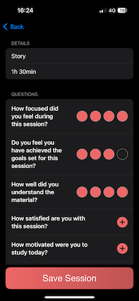

# ⏳PomoTracker⏳
*This is a simple iOS productivity app built with Swift and SwiftUI that helps users stay focused and track their progress using the Pomodoro Technique.* 

## Features 🚀

- *Focus Timer: Set timers for focused study sessions and breaks.*
- *Progress Tracking: Record your study details and rate your sessions.*
- *Analytics: View your session statistics and overall scores to boost productivity.*

## Installation 💻

1. Clone this repository:  
   `git clone <https://github.com/gianpietropanico/PomoTracker-Challenge-3.git>`

2. Open the project:
   - Open the project in Xcode.
   - Build and run the app on a simulator or a real device.

3. Requirements:
   - macOS with Xcode installed.
   - iOS 17.0 or later.
  
   > ⚠️ **Disclaimer:** The app is still under development — some features are not yet implemented.
